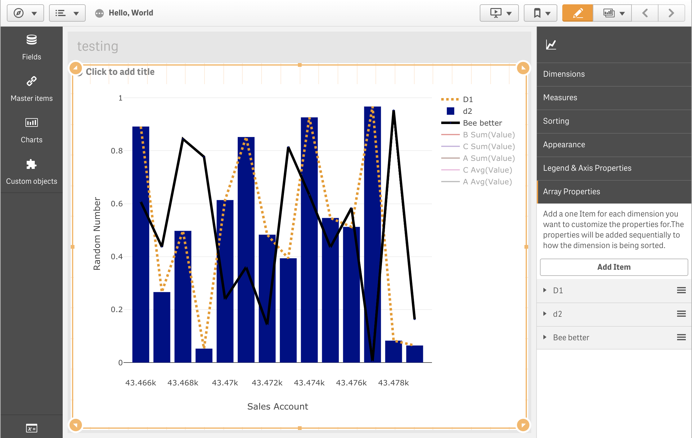

# PlotlyJS-ComboChart
## Description
A bar/line combination chart created for Qlik Sense using PlotlyJS. Lots of flexibility in use and any properties seen on 
[plotly](https://plot.ly/javascript/reference/) can be added simply using their JSON format. 

Currently accepts two dimensions and two measures.

Properties are applied to the combination chart through its array properties 

Add an array property and indicate which dimension value and which measure number you are trying to apply properties to. 
The dimension values are case sensitive.

## Requirements
built for Qlik Sense 3.0+
